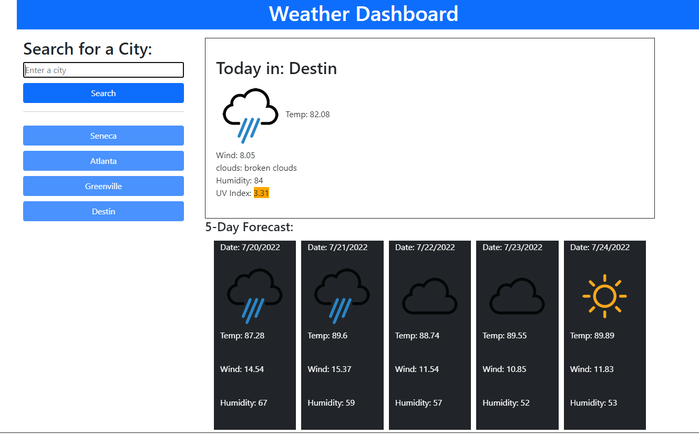

# Weather

📖Weekly Challenge 6
Implemented the following user story:

## User Story

AS A traveler
I WANT to see the weather outlook for multiple cities
SO THAT I can plan a trip accordingly

## Acceptance Criteria
GIVEN a weather dashboard with form inputs
WHEN I search for a city
THEN I am presented with current and future conditions for that city and that city is added to the search history
WHEN I view current weather conditions for that city
THEN I am presented with the city name, the date, an icon representation of weather conditions, the temperature, the humidity, the wind speed, and the UV index
WHEN I view the UV index
THEN I am presented with a color that indicates whether the conditions are favorable, moderate, or severe
WHEN I view future weather conditions for that city
THEN I am presented with a 5-day forecast that displays the date, an icon representation of weather conditions, the temperature, the wind speed, and the humidity
WHEN I click on a city in the search history
THEN I am again presented with current and future conditions for that city

## About the site

The day is displayed at the top of the planner. You have time blocks for hours 8 - 16 (8:00 - 4:00). The time blocks are color coded based on the current hour, previous hours, and future hours. You can input an event and hit the save button. Upon refresh your events will remain because they are saved to local storage.

## Assets

The URL is: https://rikrox.github.io/Weather/

Repository located at: https://github.com/RikRox/Weather
